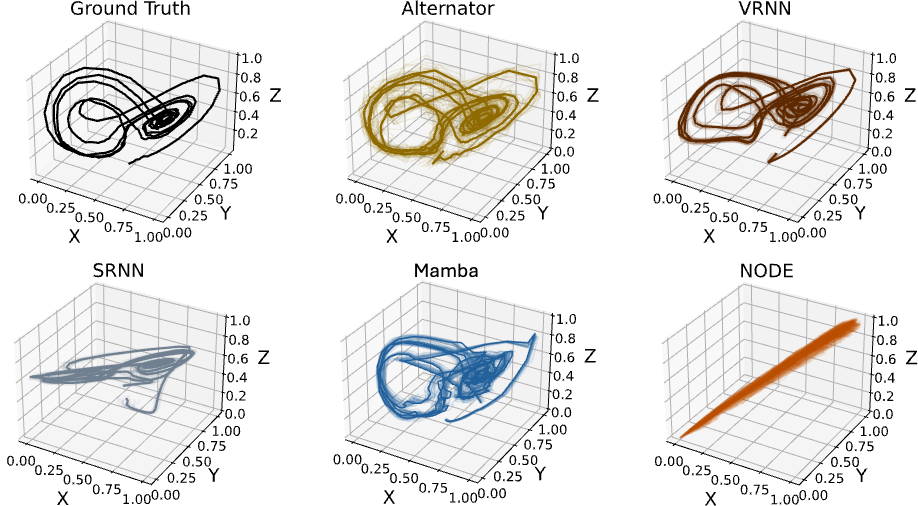

# Alternators for Dynamical Generative Modeling

This repository contains the implementation of **Alternators**, a novel family of generative models for time-dependent data. Alternators are latent-variable models featuring two neural networks: the **Observation Prediction Network (OPN)** and the **State Transition Network (STN)**. These networks alternate to generate samples in the observation space and the latent space, respectively, over a cycle.

The name "Alternator" draws an analogy with electromagnetism. Just as an electrical generator alternates mechanical energy into electrical energy, Alternators alternate between latent and observation spaces to generate dynamic data trajectories. Below is an illustration:

<p align="center">
  
</p>

<p align="center">
  <em>Illustration of Alternators: a rapid and precise framework for time-dependent generative modeling.</em>
</p>

For further details, please refer to our paper, *[Alternators for Dynamical Generative Modeling](#)*.

---

<p align="center">
  
</p>

<p align="center">
  <em>Alternators are better at tracking the chaotic dynamics defined by a Lorenz attractor.</em>
</p>
---

## Requirements

Ensure you have the following dependencies installed:
- Python 3.8+
- PyTorch 1.10+
- numpy
- matplotlib
- scikit-learn
- scipy

Install all dependencies with:
```bash
pip install -r requirements.txt
```

---

## Usage

### Running Toy Examples
1. Clone the repository:
   ```bash
   git clone https://github.com/vertaix/Alternators.git
   cd Alternators
   ```
2. Run the toy example:
   ```bash
   python alternator_test.py
   ```
3. Pretrained models will be saved in `pretrained_models_directory`, and results will be saved in `saving_result_directory`.

### Key Parameters
- **`pretrained_models_directory`**: Directory for storing pretrained models.
- **`saving_result_directory`**: Directory for saving generated results.
- **`N_steps`**: Maximum number of steps for generating the final samples.


## Citation

If you find this work useful, please cite our paper:
```bibtex
@article{rezaei2024alternators,
  title={Alternators For Sequence Modeling},
  author={Rezaei, Mohammad Reza and Dieng, Adji Bousso},
  journal={arXiv preprint arXiv:2405.11848},
  year={2024}
}
```

---

For questions or support, please raise an issue in this repository. Happy modeling! 🚀