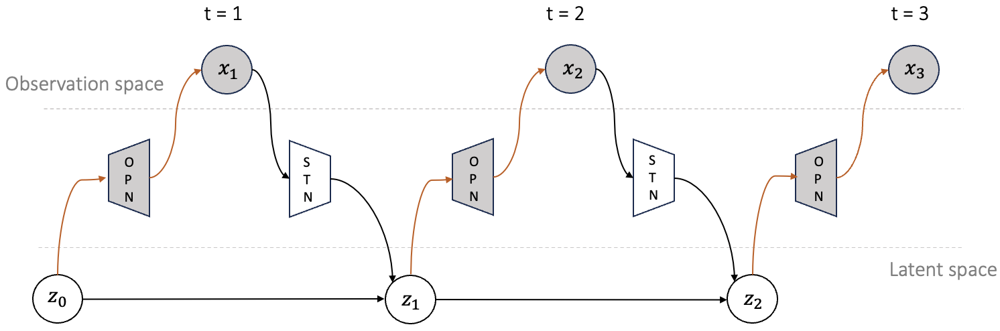

# Alternators For Dynamical Generative Modeling

This repository contains the implementation of the Alternators,
a novel family of generative models for time-dependent data. 
An alternator is a latent-variable model that features two neural networks:
the OPN and the STN. The OPN and the STN work in conjunction,
alternating between outputting samples in the observation space and the
latent space, respectively, over a cycle.

We used the name "alternator" because we can draw an analogy
with electromagnetism. The OPN and the STN are analogous to the mechanical
part of an electrical generator, whereas the trajectories are analogous to
the alternating currents that result from turning mechanical energy into
electrical energy. See bellow for an illustration:


<p align="center">

</p>

<p align="center">
<em>The Alternators offer a rapid and precise generative framework for generative modeling. See below for an illustration.</em>
</p>


<p align="center">

</p>


For more information, please see our paper,
[Alternators For Dynamical Generative Modeling]().

## Usage

You can use Alternators for regenerating the toy examples by cloning this repository:
```
git clone https://github.com/vertaix/Alternators.git
cd Alternators
pip install -r requirements.txt
python toy_example.py --dataset_name 'pinwheel' --test True --model_path './pretrained_models_dirctory/' --result_path './saving_result_directory'
```
-**pretrained_models_dirctory** is the directory that pretrained models are saved.

-**saving_result_directory** is the target directory for the results 

This example code covers four different synthetic datasets: checkerboard, 2spirals, 8gaussians, and pinwheel.

Or simply use 
```
python toy_example.py
```
For default setup.

## Pretrained models 
You can find the pretrained models for the experiments in this[repository]().
## Train from scratch
```
python toy_example.py --dataset_name 'pinwheel' --test False --batch_size 1000 --num_epochs 10000 --N_steps 15 
```

-**N_steps** is the maximum number of steps for the generative process to generate the final samples 
## Citation
```bibtex
@article{xx,
  title={xx},
  author={xx},
  journal={xx},
  year={xx}
}
```
